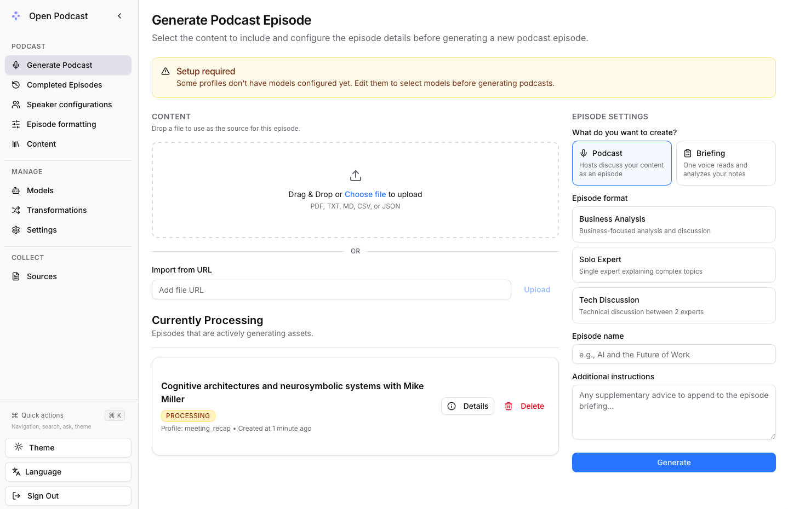

# Open Podcast

Open Podcast is a local-first audio generator. Drop in a document (PDF, text, markdown, CSV, or JSON) and it turns it into audio, entirely on your own machine using local models. It can produce two kinds of output:

- **Podcast:** hosts discuss your content as a multi-speaker episode.
- **Briefing:** a single voice reads and analyzes your notes, like an analyst reporting back to you.

It is a focused fork of [Open Notebook](https://github.com/lfnovo/open-notebook) (MIT), stripped down to do one thing well: turn documents into audio worth listening to.



## Podcast or Briefing

The Generate page asks one question first: what do you want to create? Each mode has its own formats, which are plain episode-profile records you can edit under Episode formatting.

**Podcast formats** (multi-speaker discussion): Business Analysis, Solo Expert, Tech Discussion.

**Briefing formats** (one analyst voice):

- **Discovery Debrief:** a skeptical customer-discovery analyst reads an interview transcript and reports honestly whether a business opportunity is visible in it. Hunts for the workaround that survives despite paid tools; refuses to inflate weak signals.
- **Meeting Recap:** your meeting read back as your own first-person notes: headline, key points, decisions, action items with owners and dates, and open questions.

To add a new briefing format: create a 1-speaker speaker configuration and an episode profile with your analyst prompt as the briefing, then register the profile name in `frontend/src/lib/podcast-modes.ts`.

## Quote integrity in briefings

Analysts that quote sources must quote them exactly, and local models paraphrase even when told to copy. Two safeguards handle this:

- Documents too large for the model's context window are shrunk differently per mode. Podcasts summarize (map-reduce). Briefings use **selection by number**: the source is split into numbered segments, the model replies only with segment numbers to keep, and the app slices those segments from the original text itself. The analyst's source material is verbatim by construction, regardless of model quality.
- Every briefing prompt carries hard rules: quote only text that appears word for word in the content, and never repeat the same quote across sections.

## Picking voices

- Every speaker row on the Generate page shows its voice with an instant play button (samples are pre-rendered per mode, so a briefing voice previews as an analyst, not a podcast host).
- **Change** opens a picker with all Kokoro voices, filterable by gender and accent, each with its own sample.
- With a document loaded, **Read my content** previews a voice reading your actual opening lines through the local TTS engine.
- A full **Voice Library** page lives under Speaker configurations for browsing and copying voice IDs.

## After generation

- Completed episodes have an inline audio player, a **Details** dialog (summary, outline, and the full spoken transcript), and a **Transcript** button that downloads the exact text being read as a `.txt` file named after the episode.
- The Currently Processing panel sits next to the generate form while an episode renders.
- If a generation job dies, the app watches the job after submission and surfaces the real backend error as a toast instead of failing silently.

## What's different from Open Notebook

Open Notebook is a broad, privacy-focused research assistant (notebooks, sources, notes, chat, search, and podcasts). Open Podcast keeps the podcast engine and removes the rest, with the workflow rebuilt around uploading a document and generating audio:

- **Podcast-only navigation:** Generate Podcast, Completed Episodes, Speaker configurations, Episode formatting, Content.
- **Two generation modes** (Podcast and Briefing) with format cards instead of a bare profile dropdown.
- **Drag-and-drop upload** as the primary way to add content (PDF, TXT, MD, CSV, JSON), plus import-from-URL.
- **Client-side PDF text extraction** (via pdf.js) so PDFs work without extra setup, including in Safari/WebKit shells.
- **Auto-filled episode name** taken from the uploaded file.
- **Smart model routing:** small documents use a fast local model; large ones automatically switch to a more capable model, with a heads-up that it may take a little longer.
- **Mode-aware condensing:** oversized documents are summarized for podcasts and reduced to verified verbatim excerpts for briefings.
- **Voice previews everywhere** and per-episode transcript download.

## How it works

Everything runs locally, no data leaves your machine:

- **Text** (outline + script): [Ollama](https://ollama.com) — `qwen2.5` for small documents, `qwen2.5:14b` for large ones
- **Voices** (text-to-speech): [Kokoro](https://github.com/remsky/Kokoro-FastAPI)
- **API:** FastAPI (port 5055)
- **Database:** SurrealDB
- **UI:** Next.js (this fork's frontend lives in `frontend/`)

## Quick start

Prerequisites: [Docker](https://www.docker.com/), [Ollama](https://ollama.com), and [Node.js](https://nodejs.org/).

1. Pull the local models:
   ```bash
   ollama pull qwen2.5         # fast model for small documents
   ollama pull qwen2.5:14b     # capable model for large documents
   ollama pull nomic-embed-text
   ```
   Large documents need a bigger context window, so start Ollama with:
   ```bash
   OLLAMA_CONTEXT_LENGTH=32768 ollama serve
   ```

2. Create a local `.env` with an encryption key (used to encrypt any stored API keys):
   ```bash
   echo "OPEN_NOTEBOOK_ENCRYPTION_KEY=$(openssl rand -hex 24)" > .env
   ```

3. Start the API, database, and Kokoro voices:
   ```bash
   docker compose up -d
   docker run -d --name kokoro-tts -p 8880:8880 ghcr.io/remsky/kokoro-fastapi-cpu:latest
   ```

4. Run the Open Podcast UI from source:
   ```bash
   cd frontend
   npm install
   npm run dev
   ```
   Open http://localhost:3000.

> **Note:** `docker compose` runs the upstream prebuilt API image. The Open Podcast interface is the Next.js app in `frontend/`, so run it with `npm run dev` (or build the included `Dockerfile`).

Before generating, open **Models** to register your local Ollama and Kokoro models, then set them on your profiles under **Speaker configurations** and **Episode formatting**. Speaker configurations must have a voice model linked, or generation jobs fail at submission. Episode profiles (including the briefing formats above) are data: create them in the UI or through the API.

## Credit

Built on [Open Notebook](https://github.com/lfnovo/open-notebook) by lfnovo, MIT licensed (see [LICENSE](LICENSE)). The upstream project is a full research assistant and is well worth a look. This is a personal fork and a work in progress.
